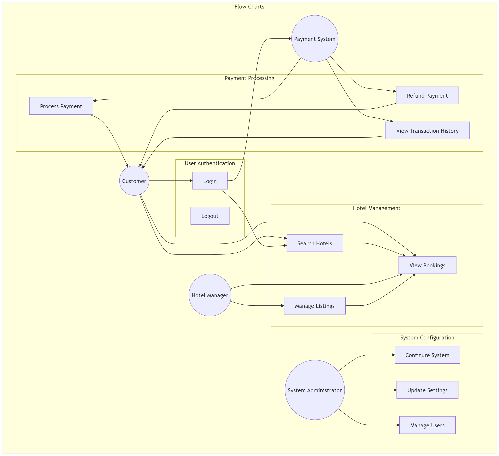

# Requirement Analysis in Software Development

## Overview
This repository serves as a comprehensive resource for understanding and implementing Requirement Analysis in software development projects. Requirement Analysis is a critical phase in the Software Development Life Cycle (SDLC) that involves gathering, analyzing, documenting, and validating requirements from stakeholders to ensure successful project delivery.

## Purpose
The purpose of this repository is to:
- Document best practices in requirement analysis
- Provide templates and tools for requirement gathering
- Share examples of well-structured requirements documentation
- Demonstrate techniques for requirement validation and verification

## Why is Requirement Analysis Important?

1. **Reduces Project Risks and Costs**
   - Helps identify potential issues early in the development cycle
   - Minimizes expensive changes and rework during later stages
   - Provides clear direction, reducing the risk of project failure

2. **Ensures Stakeholder Satisfaction**
   - Aligns project outcomes with stakeholder expectations
   - Creates a shared understanding between development teams and clients
   - Facilitates better communication and collaboration

3. **Improves Project Planning and Execution**
   - Enables accurate resource allocation and timeline estimation
   - Helps in defining clear project scope and preventing scope creep
   - Provides a solid foundation for system design and development

4. **Enhances Quality Control**
   - Establishes clear criteria for project success
   - Enables effective testing and validation
   - Ensures all critical features and requirements are addressed

## Key Activities in Requirement Analysis

### 1. Requirement Gathering
- Collecting initial requirements from stakeholders
- Conducting interviews and surveys
- Organizing workshops and brainstorming sessions
- Reviewing existing documentation and systems
- Observing current work processes

### 2. Requirement Elicitation
- Analyzing gathered information in detail
- Identifying hidden requirements
- Clarifying ambiguous requirements
- Using techniques like prototyping and user stories
- Conducting follow-up sessions with stakeholders

### 3. Requirement Documentation
- Creating formal requirement specifications
- Writing user stories and use cases
- Developing requirement traceability matrices
- Maintaining requirement change history
- Creating requirement management plans

### 4. Requirement Analysis and Modeling
- Creating visual models (UML diagrams, flowcharts)
- Identifying relationships between requirements
- Categorizing requirements (functional/non-functional)
- Prioritizing requirements
- Analyzing feasibility and constraints

### 5. Requirement Validation
- Reviewing requirements with stakeholders
- Verifying requirement consistency and completeness
- Conducting requirement walkthroughs
- Validating against project goals and constraints
- Getting formal sign-off from stakeholders

## Types of Requirements

### Functional Requirements
Functional requirements define what the system should do - the specific features and functionalities.

#### User Management
- Users must be able to register and create accounts
- Users must be able to log in securely
- Users must be able to manage their profiles
- Hotel managers must have separate login portals

#### Hotel Management
- Hotel managers must be able to list their properties
- Managers must be able to update hotel information
- Managers must be able to manage room availability
- Managers must be able to set pricing and special offers
- Managers must be able to view booking statistics

#### Search and Booking
- Users must be able to search hotels by location
- Users must be able to filter hotels by price, ratings, and amenities
- Users must be able to view hotel details and photos
- Users must be able to book rooms for specific dates
- System must prevent double booking of rooms
- Users must receive booking confirmations

#### Payment Processing
- System must support multiple payment methods
- System must process payments securely
- System must generate invoices
- System must handle refunds when applicable

#### Notifications
- System must send booking confirmations to users
- System must notify hotel managers of new bookings
- System must send reminder notifications for upcoming stays
- System must notify users about booking changes

### Non-functional Requirements

#### Performance
- System must handle 1000+ concurrent users
- Search results must load within 2 seconds
- Payment processing must complete within 5 seconds
- System must be available 99.9% of the time
- Database must support 10,000+ hotel listings

#### Security
- All user data must be encrypted
- Payment information must be processed using secure protocols
- System must implement two-factor authentication
- System must maintain audit logs of all transactions
- Regular security updates must be implemented

#### Scalability
- System must scale horizontally to handle increasing load
- Database must handle growing data volume efficiently
- CDN must optimize content delivery across different regions

#### Usability
- Interface must be responsive across all devices
- System must support multiple languages
- Search interface must be intuitive
- Booking process must be completable in less than 5 steps
- System must provide clear error messages

#### Data Management
- System must backup data every 24 hours
- System must maintain data consistency across all services
- System must comply with data protection regulations
- System must maintain booking history for at least 2 years

#### Integration
- System must integrate with third-party payment services
- System must integrate with external mapping services
- System must support API integration for partners
- System must integrate with email and SMS services

## Use Case Diagrams

### Overview
Use Case Diagrams are fundamental tools in requirement analysis that visually represent how users (actors) interact with a system. They help stakeholders understand the system's functionality from an external perspective and clarify the relationships between different use cases and actors.

### Benefits of Use Case Diagrams
- Provide a high-level view of the system
- Identify external actors and their interactions
- Clarify system boundaries
- Help in understanding user requirements
- Facilitate communication with stakeholders
- Aid in project scope definition

### Hotel Booking System Use Case Diagram

### Actors in the System
1. **Customer**
   - Regular users who search and book hotels
   - Can manage their bookings and profile
   - Interacts with payment system
   - Can write and view reviews

2. **Hotel Manager**
   - Manages hotel listings and rooms
   - Handles booking requests
   - Updates availability and pricing
   - Views and responds to reviews

3. **System Administrator**
   - Manages system configuration
   - Handles user management
   - Monitors system performance
   - Updates system settings

4. **Payment System**
   - External actor handling payment processing
   - Processes transactions
   - Handles refunds
   - Maintains transaction history

### Key Use Cases
1. **User Management**
   - Register Account
   - Login/Logout
   - Manage Profile
   - Reset Password
   - Update Personal Information

2. **Hotel Management**
   - List Property
   - Update Hotel Information
   - Manage Room Availability
   - Set Pricing
   - View Bookings
   - Manage Listings

3. **Booking Process**
   - Search Hotels
   - View Hotel Details
   - Make Reservation
   - Cancel Booking
   - Process Payment
   - Generate Booking Confirmation
   - View Transaction History

4. **System Administration**
   - Configure System
   - Update Settings
   - Manage Users
   - Monitor Performance
   - Generate Reports

5. **Review System**
   - Write Review
   - Rate Hotel
   - View Reviews
   - Manage Review Responses

6. **Payment Processing**
   - Process Payments
   - Handle Refunds
   - View Transaction History
   - Generate Payment Reports

## Contents
- Documentation templates
- Best practices guidelines
- Case studies
- Tools and techniques
- Sample requirements specifications

This repository will be continuously updated with relevant materials and resources related to requirement analysis in software development.